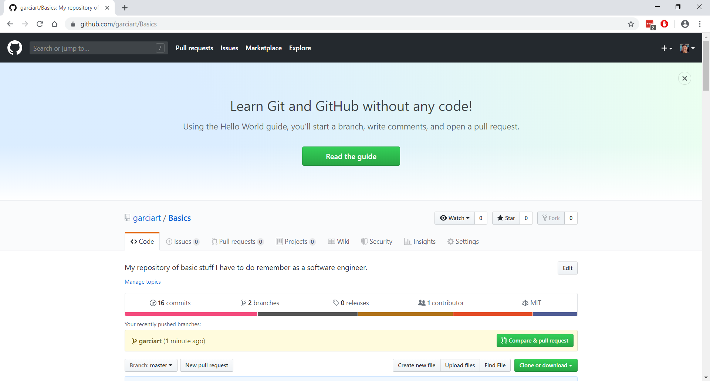
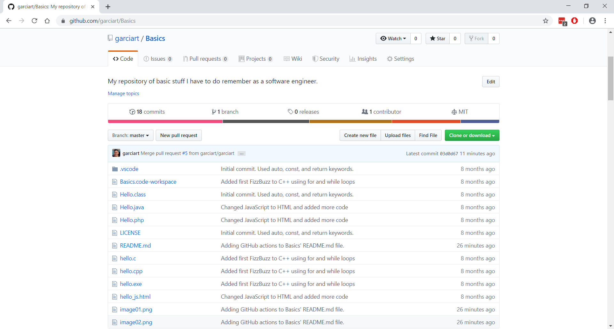

# The Basics - My Source Control Plan

## Introduction

When I first started using Git and GitHub, I did not use them properly. Instead of maintaining a code history, I would only upload to GitHub when I was done coding or create separate repositories for each phase, sprint, etc.. Now, regardless of how small a change is, if I am done coding, I commit on a separate branch (as I would with a development team) and I use pull requests to update the master branch.

> **Note:**  Installing Git or creating a GitHub account are out of the scope of this document. I recommend visiting the official sites, [Getting Started - Installing Git](https://git-scm.com/book/en/v2/Getting-Started-Installing-Git)< and [GitHub](https://github.com/), for the latest and greatest directions.

## The Plan

If you are using GitHub, take the following steps:

Open a browser and sign into GitHub:

If this is a new project, create a repository on GitHub first by selecting Repositories->New. Do not check the "Initialize this repository with a README" or add a .gitignore or license; we'll do that locally to avoid a pull request:

Now, open a terminal/command prompt/powershell to create a local repository and connect it to the remote repository:

    cd C:\Users\[USERNAME]\source\repos # Go to where your repositories are stored (Windows shown here)
    md GitTest # Create the project folder
    cd GitTest # Go to the project folder
    git init # Initialize a repository
    touch .gitattributes # Add a placeholder for an attributes file
    touch .gitignore # Add a placeholder for a list of files to ignore
    touch README.MD # Add a placeholder for the description of the application
    touch LICENSE # Add a placeholder for the appropriate license (e.g., MIT, BSD, etc.)
    git add --all # Move changes to the INDEX (i.e., the staging area)
    git commit -m "Initial commit." # Commit all changes to the HEAD (i.e., the final product to submit to the REMOTE MASTER repository)
    git remote add origin https://github.com/[YOUR GITHUB ACCOUNT]/GitTest
    git push -u origin master # Push the repository to GitHub

For existing projects:

    git clone https://github.com/[YOUR GITHUB ACCOUNT]/GitTest.git # Clone the REMOTE MASTER repository into a local WORKING DIRECTORY
    cd GitTest # Go into the WORKING DIRECTORY

By the way, if your code applies to multiple platforms, I recommend making sure:

- *Watch your line endings if switching between OS's!*
- *Make sure you stick with either tabs or spaces!*

Git can automatically fix your line feeds using one of the following commands:

    git config --global core.autocrlf false # For Linux
    git config --global core.autocrlf true # For Windows

You can also set the line feeds for each project by replacing "--global" with "--local".

Once your repository is set up:

    git status # Get the status of the repository
    git branch [USERNAME] # Create a branch, identified by your name
    git branch # Make sure the branch was created
    git checkout [USERNAME] # Switch to your branch
    git branch # Make sure the branch was switched

Modify the code, and if you need to take a break:

    cd C:\Users\[USERNAME]\source\repos\GitTest # Go back to the root of the WORKING DIRECTORY
    git status # Get the status of the repo
    git add --all # Move changes to the INDEX (i.e., the staging area)

Continue making changes as necessary, repeating the above commands whenever you need a break. When you are ready to commit:

    git commit -m "[COMMIT MESSAGE]" # Commit all changes to the HEAD (i.e., the final product to submit to the REMOTE MASTER repository)
    git push origin [USERNAME] # Push your branch to the REMOTE MASTER repository for approval

Select Repositories and open the repository:

Note the information banner immediately above the list of recently pushed branches; it shows that there are two branches, which must be resolved into one branch. Open the pull request by clicking on "Compare & pull request":

Here, acting as [USERNAME], you can review changes, add comments to the request, assign additional reviewers, etc., before creating the pull request. For now, click on "Create Pull Request":

That would be the last step for user branch, unless there were conflicts. Next, the repository master would sign in to review changes, add comments to the request, assign additional reviewers, etc., before merging the branch pull request with the master repository. For now, since the branch has no conflicts with the base branch, click on "Merge Pull Request", followed by "Confirm merge":

Once the merge is successful, you can delete the branch:

Return to the repository's main page and you will see that there is now only one branch:

If you make changes to the repository in GitHub, you can update the local repository by using the following command at the terminal:

    git status # Get the status of the repository
    git pull origin master # Combines git fetch and git merge to update user branch

Or you can switch back to the master branch and pull:

    git status # Get the status of the repository
    git checkout master # Switch back to the master branch
    git pull # Update master branch
    git checkout [USERNAME] # Switch back to user branch
    git merge master # Update user branch

If the user branch will not be used again, you may delete it using the following command:

    git branch -D [USERNAME] # Delete the old branch

However, you can leave the branch open and continue updating the repository as necessary.

One last thing: sometimes, you may want to prevent certain files or folders from appearing in your public repo (i.e., GitHub). To hide them, add the names of the files and folders to your .gitignore file:

    # Ignore the following folders and their contents
    .vscode/

Once that is done, run the following commands:

    git rm -r --cached . # Clears the cache of the entire Git staging area
    git status # Get the status of the repo
    git add --all # Move changes to the INDEX (i.e., the staging area)
    git commit -m "[COMMIT MESSAGE]" # Commit all changes to the HEAD (i.e., the final product to submit to the REMOTE MASTER repository)
    git push origin [USERNAME] # Push your branch to the REMOTE MASTER repository for approval

## Summary

This is a basic, get-you-started guide to source control. I suggest you sit down with your team and create your own version, to ensure everyone is on the same sheet of music. Good luck!
